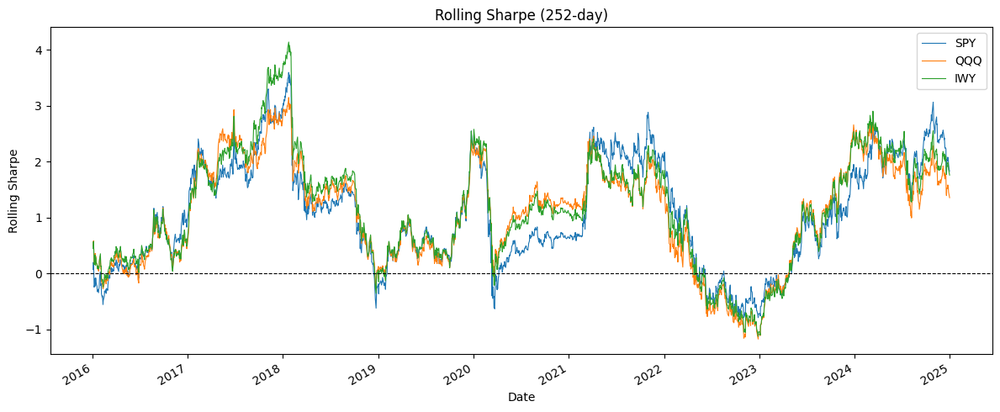

# DCA Backtester

A Python-based Dollar-Cost Averaging backtester for US ETFs.
Evaluates strategy performance with IRR, Sharpe, MDD and rolling regime analysis.

## Why I built this
Most DCA discussions online quote returns without showing the underlying assumptions.
I wanted to evaluate the original strategy and extended strategies I designed — 
to evaluate performance using proper metrics like IRR, Sharpe, MDD 
— across different assets and periods, with yfinance numbers while keeping the logic transparent and reproducible.

## Results (2015–2025, $1,000/month)

| Metric         | SPY        | QQQ        | IWY        |
|----------------|------------|------------|------------|
| Total Invested | 120,000    | 120,000    | 120,000    |
| Final Value    | 256,240    | 334,890    | 337,098    |
| IRR            | 15%        | 20%        | 20%        |
| Volatility     | 18%        | 22%        | 20%        |
| Sharpe         | 0.78       | 0.88       | 0.92       |
| Sortino        | 0.95       | 1.12       | 1.15       |
| MDD            | -33%       | -31%       | -30%       |

## Rolling Sharpe Ratio (252-day)

| Rolling Sharpe | SPY   | QQQ   | IWY   |
|----------------|-------|-------|-------|
| Mean           | 1.08  | 1.08  | 1.17  |
| Max            | 3.60  | 3.15  | 4.14  |
| Min            | -0.79 | -1.17 | -1.12 |

All three ETFs peaked 2018-01-23 and bottomed 2022-12-28 — the Fed rate hike cycle is visible in rolling Sharpe.
IWY: Best risk-adjusted return (highest Sharpe mean, highest max)
QQQ: Highest absolute return (IRR 19%) but worst downside (min -1.17)

## How it works

- Buys on the first actual trading day of each month (not calendar day 1)
- IRR as primary return metric — accounts for cash flow timing; CAGR assumes lump sum
- Rolling Sharpe surfaces regime changes hidden by static metrics

## Key technical decisions

**First trading day detection**
`groupby(pd.Grouper(freq="MS")).nth(0)` — not `.first()` or `resample()`,
which return calendar month start regardless of whether markets are open.

**`run_backtest()` returns `(metrics, df)` tuple**
Rolling analysis reuses the same return stream from the main pipeline.
Splitting into two functions would duplicate `load_data > calc_portfolio > calc_metrics`.
Trade-off: downstream code unpacks a tuple instead of a plain dict.

## Limitations & next steps

**Known limitations**
- No transaction costs or slippage
- IRR assumes end-of-period liquidation
- Local parquet only; no live data feed

**Planned**
- Strategy B: Buy only on down months (conditional signal)
- Gemini API: Auto-generate narrative report from metrics dict
- GCS + BigQuery: Replace local parquet with cloud pipeline
