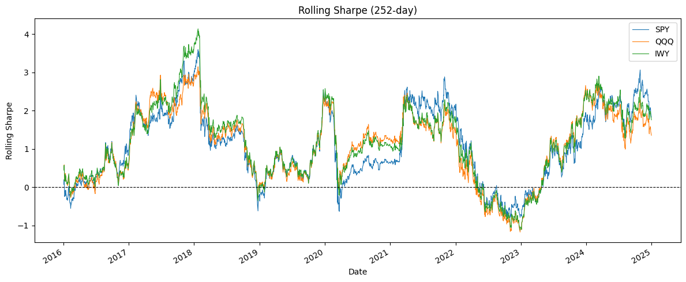

# DCA Backtester

A Python-based Dollar-Cost Averaging backtester for US ETFs.
Evaluates strategy performance with IRR, Sharpe, MDD and rolling regime analysis.

## Why I built this
Most DCA discussions online quote returns without showing the underlying assumptions.
I wanted to evaluate the original strategy and extended strategies I designed — 
to evaluate performance using proper metrics like IRR, Sharpe, MDD 
— across different assets and periods, with yfinance numbers while keeping the logic transparent and reproducible.

## How it works
- Strategy A: buys on the first actual trading day of each month (not calendar day 1)
- Strategy B: buys when the ETF (or RSP) drops ≥ 1% — executed next day at open;
  falls back to the third Friday of the month if no dip occurs
- IRR as primary return metric — accounts for cash flow timing unlike CAGR
- Rolling Sharpe surfaces regime changes hidden by static metrics

## Results (2015–2025, $1,000/month)

### Strategy A — First Trading Day (Baseline)

| Metric         | SPY     | QQQ     | IWY     |
|----------------|---------|---------|---------|
| Total Invested | 120,000 | 120,000 | 120,000 |
| Final Value    | 257,240 | 335,890 | 338,098 |
| IRR            | 14.6%   | 19.5%   | 19.7%   |
| Volatility     | 17.6%   | 21.8%   | 20.0%   |
| Sharpe         | 0.78    | 0.88    | 0.92    |
| Sortino        | 0.95    | 1.12    | 1.15    |
| MDD            | -32.9%  | -31.4%  | -30.0%  |

### Strategy B — Dip Signal + Third-Friday Fallback (QQQ, 2015–2025, Threshold = 1%)

| Strategy & Signal Type | IRR    | Sharpe | MDD     |
|------------------------|--------|--------|---------|
| First Day              | 19.5%  | 0.88   | -31.4%  |
| dip_self + close       | 19.6%  | 0.90   | -31.4%  |
| dip_self + low         | 19.6%  | 0.89   | -31.4%  |
| dip_rsp + close        | 19.6%  | 0.89   | -31.3%  |
| dip_rsp + low          | 19.5%  | 0.89   | -31.3%  |

**Finding:** Within QQQ, Conditional dip strategies (B) show marginal improvement over baseline (A) in Sharpe, IRR and MDD.
Other assets show similar pattern.

## Strategy A - Rolling Sharpe Ratio (252-day)

| Rolling Sharpe | SPY   | QQQ   | IWY   |
|----------------|-------|-------|-------|
| Mean           | 1.08  | 1.08  | 1.17  |
| Max            | 3.60  | 3.15  | 4.14  |
| Min            | -0.79 | -1.17 | -1.12 |

**Finding:** Asset selection (SPY vs QQQ vs IWY) has a larger impact on outcome than signal timing within the same asset.

## Key Decisions & Tradeoffs

**Incomplete date range > skip rather than truncate**
When a ticker's available data starts after the requested start_date, the backtest skips that ticker entirely rather than running on a shorter window.
Trade-off: fewer results shown, but avoids comparing strategies across unequal time periods.

**Two dip signal variants: `close` vs `low`**
`close` compares prior-day close-to-close return; `low` uses intraday low vs prior close.
Both are valid assumptions depending on whether you execute at open or at close.
Kept both as a `signal_type` parameter rather than hardcoding one.

**Third-Friday fallback**
Third Friday chosen as a fixed mid-month anchor to guarantee one buy per month.
Trade-off: any dip occurring after the third Friday is missed for that month.

**`dip_rsp` fallback to `dip_self`**
When RSP data is unavailable, the pipeline falls back to self-signal rather than crashing.
Trade-off: the two signals have different economic assumptions (broad market breadth vs own-price momentum);
fallback is a pipeline safety net, not a strategy equivalence.

**Monthly wallet = 1**
Even when multiple dip signals fire in the same month, only the first is executed.
wallet = 2 would better capture consecutive down days, but increases pipeline complexity and makes cash flow less predictable.
Kept at 1 for MVP scope; can be parameterised later.

## Limitations & next steps

**Known limitations**
- No transaction costs or slippage
- IRR assumes end-of-period liquidation
- Local parquet only; no live data feed

**Planned**
- Strategy C: additional buy when monthly return drops ≥ 5% (additive layer on Strategy A)
- Gemini API: Auto-generate narrative report from metrics dict
- GCS + BigQuery: Replace local parquet with cloud pipeline
